# `helix-myohtml`

`helix-myohtml` is a Cloudflare Worker that acts as a BYOM HTML composer for an EDS site backed by DA. It fetches the DA HTML document for a page, preserves the DA-owned page shell, finds `embed` blocks inside `<main>`, fetches allowed remote HTML documents, extracts their `<main>` content, and merges that content into the host page.

The service shape is intentionally close to `helix-json2html`: simple Worker entrypoint, KV-backed config, branch-aware configuration storage, and a request model that can sit directly in front of DA/EDS as the content source.

## Purpose

The Worker exists to solve one specific problem:

- DA authors want to place `embed` blocks in page content
- preview/live output should inline the referenced fragment or remote HTML content
- the DA page shell, metadata, header, and footer should remain authoritative

At runtime, the Worker becomes the page composer. DA remains the source of the host page, while the Worker performs the remote fragment merge.

## Current Behavior

The backend contract implemented here is:

- `GET /health` returns readiness JSON
- `POST /config/:org/:site/:branch` stores normalized site config in KV
- `GET /:owner/:site/<content-path>` is the primary content route
- branch `main` is implied for `/owner/site/...` routes
- the default upstream for `/owner/site/...` is `https://content.da.live/<owner>/<site>`
- the default allowlist auto-includes:
  - `https://main--<site>--<owner>.aem.page`
  - `https://main--<site>--<owner>.aem.live`

Observed integration behavior:

- DA does call the Worker correctly when the DA site config points to the Worker
- preview/live composition is a Worker concern and is tested here
- DA authoring UI appears to preserve or reconstruct the editable `embed` block table independently of the Worker response
- because of that, authoring-table rendering is not asserted as a Worker-level backend contract

## Request Flow



The editable Mermaid source lives in [diagrams/request-flow.mmd](./diagrams/request-flow.mmd). The rendered SVG checked into the repo is [diagrams/request-flow.svg](./diagrams/request-flow.svg).

## External Interface

### `GET /health`

Returns:

```json
{
  "status": "ok",
  "service": "helix-myohtml"
}
```

### `POST /config/:org/:site/:branch`

Stores the branch-scoped site config in the `CONFIGS` KV namespace.

Example:

```json
{
  "embeds": {
    "allowedOrigins": [
      "https://json2html.adobeaem.workers.dev"
    ],
    "maxDepth": 2,
    "timeoutMs": 3000,
    "onError": "omit"
  }
}
```

If `CONFIG_API_TOKEN` is set, writes require:

- `Authorization: Bearer <token>`
- or `Authorization: token <token>`

### `GET /:owner/:site/<content-path>`

This is the primary route used by the current implementation.

For a request such as:

```text
/cpilsworth/myohtml/fragments/test
```

the Worker:

1. resolves owner `cpilsworth`, site `myohtml`, branch `main`
2. loads `config:v1:cpilsworth/myohtml/main` from KV if it exists
3. infers the upstream `https://content.da.live/cpilsworth/myohtml`
4. augments the embed allowlist with the site preview/live origins
5. fetches and composes the page

### `GET /<content-path>`

Fallback single-site mode. If `DEFAULT_CONFIG="<org>/<site>/<branch>"` is set, non-owner/site paths use that stored config.

## Composition Rules

For each page request the Worker:

1. fetches the DA HTML document from the configured upstream
2. preserves the outer page shell from DA: `<html>`, `<head>`, `<body>`, `<header>`, `<footer>`, page metadata
3. scans only `<main>` for blocks with class `embed`
4. uses the first anchor `href` inside the block as the embed source
5. only fetches embeds from allowed origins
6. extracts only the imported document’s `<main>` content
7. removes imported `<script>` and head-only noise
8. rebases relative `href` and `src` values against the imported document URL
9. resolves nested embeds up to `maxDepth`
10. omits embeds on allowlist failure, timeout, parse failure, missing `<main>`, or non-200 embed response

## Implementation Overview

The implementation is deliberately lightweight and dependency-free.

### Request Resolution

[src/index.js](./src/index.js) handles:

- routing
- health/config/content endpoints
- request logging
- upstream fetch orchestration
- final HTML response construction

### Config Model

[src/lib/config.js](./src/lib/config.js) handles:

- KV key generation
- config validation and normalization
- implicit `/owner/site` route config synthesis
- inferred DA upstream generation from owner/site
- auto-derived preview/live allowlist origins
- stored config merge behavior

### HTML Composition

[src/lib/compose.js](./src/lib/compose.js) handles:

- upstream page fetch
- embed discovery and replacement
- recursive composition
- URL rebasing
- soft-fail omission behavior

[src/lib/html.js](./src/lib/html.js) contains the lightweight HTML parsing helpers used by the composer.

## Project Structure

- `src/index.js`
  Worker entrypoint, routing, structured logging, response handling
- `src/lib/config.js`
  KV config storage, route parsing, implicit site config derivation
- `src/lib/compose.js`
  upstream fetch and embed composition logic
- `src/lib/html.js`
  `<main>` extraction, embed block discovery, URL rebasing helpers
- `examples/`
  sample DA page, embedded source, composed output, and config
- `diagrams/request-flow.mmd`
  request/response flow diagram
- `test/index.test.js`
  route and lower-level composition tests
- `test/integration.test.js`
  higher-level integration-style Worker tests

## Installation

Requirements:

- Node.js 20+ recommended
- npm
- a Cloudflare account if you want to deploy

From the repo root:

```bash
cd helix-myohtml
npm install
```

This installs the only declared development dependency:

- `wrangler`

## Build

There is no separate build step in this project.

The Worker source is plain ESM JavaScript, and Wrangler bundles it during:

- `npm run dev`
- `npm run deploy`
- `npx wrangler deploy`

If you want a bundle validation step without deploying:

```bash
npx wrangler deploy --dry-run --outdir /tmp/helix-myohtml-dryrun
```

To re-render the request-flow diagram after editing the Mermaid source:

```bash
npx mmdc -i diagrams/request-flow.mmd -o diagrams/request-flow.svg
```

## Local Development

Start the local Worker:

```bash
npm run dev
```

That runs:

```bash
wrangler dev
```

Optional local environment variables can be placed in `.dev.vars`:

```dotenv
DEFAULT_CONFIG=cpilsworth/myohtml/main
CONFIG_API_TOKEN=replace-me
```

Use `DEFAULT_CONFIG` only if you want fallback non-owner/site routing. The primary route model is `/owner/site/...`.

## Configuration

The Worker expects a KV namespace binding named `CONFIGS`.

Current `wrangler.jsonc` configuration:

```jsonc
{
  "name": "helix-myohtml",
  "main": "src/index.js",
  "compatibility_date": "2026-04-02",
  "compatibility_flags": ["nodejs_compat"],
  "observability": {
    "enabled": true,
    "head_sampling_rate": 1
  },
  "kv_namespaces": [
    {
      "binding": "CONFIGS",
      "id": "a6613a6211aa4cf3a8d97d2488b85ba3",
      "preview_id": "a6613a6211aa4cf3a8d97d2488b85ba3"
    }
  ]
}
```

To seed config through the API:

```bash
curl -i -X POST \
  -H 'content-type: application/json' \
  -d @examples/config.json \
  https://<worker-host>/config/cpilsworth/myohtml/main
```

If `CONFIG_API_TOKEN` is enabled, add:

```bash
-H "Authorization: Bearer $CONFIG_API_TOKEN"
```

## Testing

Run the full suite:

```bash
npm test
```

This currently runs:

```bash
node --test
```

Coverage includes:

- health and config endpoints
- implicit `/owner/site` route resolution
- auto-allowed preview/live origins
- embed composition
- recursive depth handling
- omit-on-error behavior
- auth-forwarding behavior to DA upstream
- fragment composition and URL rebasing
- unauthenticated upstream failure handling
- preview/publish backend composition contract

There is no browser E2E test harness in this repo. DA editor rendering is currently validated manually because it is not controlled purely by the Worker response.

### Stored Site Config

For `/owner/site/...` routes, the DA upstream base URL is inferred from the request path and does not need to be stored.

The minimal stored config shape is:

```json
{
  "embeds": {
    "allowedOrigins": [
      "https://json2html.adobeaem.workers.dev"
    ],
    "maxDepth": 2,
    "timeoutMs": 3000,
    "onError": "omit"
  }
}
```

At runtime, the worker adds:

- `https://main--<site>--<owner>.aem.page`
- `https://main--<site>--<owner>.aem.live`

Use `embeds.allowedOrigins` only for additional origins beyond the site’s own preview/live domains.

## Deployment

Deploy with Wrangler:

```bash
npm run deploy
```

or:

```bash
npx wrangler deploy
```

Typical deployment workflow:

1. install dependencies
2. confirm `wrangler.jsonc` points at the correct KV namespace
3. seed or update `CONFIGS` KV data
4. deploy the Worker
5. point the DA site config content source at the Worker URL
6. verify:
   - `/health`
   - `/owner/site/`
   - page composition with an authenticated DA request

## Logging And Diagnostics

The Worker emits structured JSON logs for:

- `content_request`
- `upstream_fetch`
- embed omission warnings

Logged request context includes:

- request URL and pathname
- selected inbound headers such as `host`, `referer`, `origin`, `user-agent`, `x-forwarded-*`, and `sec-fetch-*`
- selected `request.cf` properties like `colo`, `country`, `region`, and `asOrganization`
- resolved target, upstream base URL, allowlist, and max depth
- upstream URL, status, and selected DA headers such as `x-da-actions` and `x-da-id`

Sensitive values like `Authorization` and cookies are redacted in the structured logs.

Use live tailing during integration:

```bash
npx wrangler tail helix-myohtml --format json
```

## Known Constraints

- The Worker currently buffers full HTML documents in memory during composition.
- It does not merge imported `<head>` metadata.
- It only imports `<main>` content from remote documents.
- It does not currently distinguish DA authoring requests from preview/live requests at the backend boundary.
- DA editor behavior should not be inferred solely from the Worker response. In practice, the DA editor can still display an editable `embed` table while preview/live output is composed.

## Example Files

- [examples/da-page-with-embed.html](./examples/da-page-with-embed.html)
- [examples/embedded-source.html](./examples/embedded-source.html)
- [examples/composed-output.html](./examples/composed-output.html)
- [examples/config.json](./examples/config.json)
- [diagrams/request-flow.mmd](./diagrams/request-flow.mmd)
- [diagrams/request-flow.svg](./diagrams/request-flow.svg)
